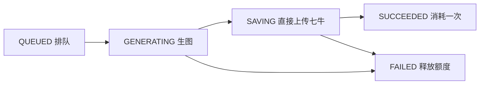

# AI 创作

## 启用

1. 先备份数据库并停止旧实例，不能让不识别 AI 预留额度的旧版与新版混跑。已有数据库执行一次 `deploy/db/migrations/20260915_ai_creation.sql`（需先完成之前的额度、管理后台迁移）；新数据库执行最新 `deploy/db/schema.sql`。应用不自动执行迁移，不要在已有库重跑初始化脚本。
2. 在开发 `.env` 或部署 `app.env` 设置 `AI_MODEL_ENCRYPTION_KEY`：32 个随机字节的 Base64。例如在可信终端用 `openssl rand -base64 32` 生成，将结果妥善保管，勿提交 Git。所有实例使用相同值；重启或发布时不能重新生成。丢失主密钥后需重新填写所有模型 API Key，尚未执行的任务快照也无法解密。
3. 构建并同步发布后端和前端，保留现有七牛、MySQL、Redis 配置。图片字节不写入数据库；多实例需共用数据库、Redis 和主密钥。
4. 管理员打开 `/admin/models`，编辑预置的 **GPT-Image-2**，填写实际 API Key，核对地址、路径、尺寸和质量后启用。初始配置不含密钥且停用，避免未经配置就产生请求。
5. 首页 `/` 为 AI 创作主入口，游客可先填写画面描述，点击“登录开始创作”后会保留描述。上传入口为 `/upload`，旧 `/create` 自动跳转首页。API Key 只在管理员提交时传至后端，随后 AES-256-GCM 加密存储；列表和编辑响应仅含 `keyConfigured`，密钥输入留空表示保留原值。

已经启用 AI 创作的数据库执行 `deploy/db/migrations/20260915_ai_resolutions.sql`，把 GPT-Image-2 的旧三种、八种或上一版 24 种尺寸同步为下表约定的 24 种有效组合；脚本可重复执行，保留自定义白名单和历史任务。此前的比例迁移仍可执行，但不再是升级的必需步骤。

升级到包含保存补偿修复的版本时，先执行一次 `deploy/db/migrations/20260916_ai_save_recovery.sql`，再启动新版后端；它为任务表增加 `pending_storage_info`。从尚未启用 AI 的旧库升级，需要先执行 AI 建表迁移，再执行本次迁移；新库的 `schema.sql` 已包含该字段。应用不会自动变更已有数据库。

AI 图片大小独立配置，修改后重启后端；普通上传保持 10 MB，不受此配置影响：

```yaml
image-hub:
  ai:
    max-image-size: 10MB
```

支持 Spring DataSize 单位（B、KB、MB），必须大于 0 且不超过 50 MB，非法值会阻止启动。模型响应、图片下载及保存均使用该上限；生成字节只在本次任务内存中传递，数据库不保存图片内容。

升级到取消结果暂存的版本时，停止全部旧实例并确认无正在执行的任务，再执行一次 `deploy/db/migrations/20260916_remove_ai_result_data.sql`。它删除 `result_data`、`result_expires_at` 及过期索引，旧版生成中、待保存或保存失败任务统一标记失败并释放预留，保留任务历史和云文件定位。删除后不能恢复旧图片字节；新库直接使用最新 `schema.sql`，无需执行历史扩容脚本。新版与旧版不能混跑。

预置参数：

| 配置 | 值 |
| --- | --- |
| 模型代码 | `gpt-image-2` |
| Base URL | `https://api.openai.com` |
| 生图路径 | `/v1/images/generations` |
| 默认尺寸 | `1024x1024` |
| 可选尺寸 | 下表中的全部 24 种有效组合 |
| 默认质量 | `medium` |
| 可选质量 | `low,medium,high,auto` |

用户端独立选择比例、分辨率和质量，分辨率选项同时显示自动计算的实际像素。计算规则：

- 按比例确定档位基准：3:2/2:3 最长边使用 1536、2160、3840；16:9/9:16 使用 1280、2560、3840；其余使用 1024、2048、3840。横竖版共用基准，保持最简宽高比，并按 16 像素对齐。
- 超过 8294400 总像素时等比缩小，比例单位向下对齐到 32；因此方形 4K 为 2880×2880，4:3 的 4K 为 3200×2400，仍保留 4K 档位。
- 低于 655360 总像素时等比上调到最小有效尺寸，避免模型拒绝；因此 16:9 的 1K 为 1280×720。
- 八种比例均提供三个档位，切换比例保留档位。由计算结果生成后台初始白名单，不再逐个写死尺寸。

| 比例 | 1K | 2K | 4K（自动适配上限） |
| --- | --- | --- | --- |
| 1:1 | 1024x1024 | 2048x2048 | 2880x2880 |
| 3:2 | 1536x1024 | 2160x1440 | 3456x2304 |
| 2:3 | 1024x1536 | 1440x2160 | 2304x3456 |
| 16:9 | 1280x720 | 2560x1440 | 3840x2160 |
| 9:16 | 720x1280 | 1440x2560 | 2160x3840 |
| 4:3 | 1024x768 | 2048x1536 | 3200x2400 |
| 3:4 | 768x1024 | 1536x2048 | 2400x3200 |
| 21:9 | 1344x576 | 2016x864 | 3808x1632 |

管理员自定义尺寸仍可使用，非计算预设显示为“自定义”。请求继续提交实际 `size`，服务端按模型白名单校验；历史任务保持原像素，详情显示比例、可识别的档位和像素。每张仍消耗 1 次额度，结果受 `image-hub.ai.max-image-size` 文件上限和调用超时约束。

本期调用 OpenAI Images 兼容协议：JSON `model,prompt,n=1,size,quality,moderation=low`（moderation 固定为 low，不提供配置项），Bearer API Key，响应支持 `b64_json` 或图片 URL。使用 Spring AI `spring-ai-openai:1.1.8`，按任务配置创建客户端，不引入依赖全局 Key 的 starter。仅支持相同请求/响应协议及上述质量枚举；其他供应商的私有字段或多步接口需要另行适配。地址需使用公网 HTTPS 标准端口，不支持内网、身份信息、重定向或将密钥放入查询参数。

供应商模型的可用性和账户权限需以实际账户为准。代码测试使用本地 HTTP 桩和虚构 Key，未执行付费生图或真实七牛上传。

## 用户行为与额度

- 每次生成固定一张；可选择管理员启用的模型、尺寸和质量，均消耗共享额度 1 次。
- 提交先预留 1 次，只有七牛上传和图片记录持久化完成才计入已用；AI 保存不再走普通上传的二次扣额。
- 每位用户同时最多一个未结束任务，由数据库唯一约束和共享额度锁保障；剩余额度仍可用于普通上传。
- `GET /api/app/images/quota` 返回 `total,used,reserved,remaining`，其中 `remaining=max(0,total-used-reserved)`。删除图片不退还额度，已计费的图片记录不可物理清理。
- 使用客户端生成的 UUID `requestId` 保证提交幂等。网络结果不明时须用**原 requestId 和参数**重试确认；更换 ID 会被视为新创作。
- 离开页面不取消后台任务；返回后从服务端恢复当前任务和历史。
- 已接收任务使用模型配置快照，之后停用或删除模型只影响新任务。
- `hub_image.source_type` 为 `UPLOAD` 或 `AI`，既有 `type` 继续表示 JPG/PNG 等文件格式。历史图片默认 `UPLOAD`。

## 失败与中断



一次领取完成生成与保存，不等待下一轮轮询，不保留跨请求、跨重启的图片字节。模型响应在 JSON 解析前按配置计算上限（Base64 长度 + 1 MiB JSON 包络），包含分块响应；Base64 解码后及 URL 下载过程继续校验实际字节数。上传前校验格式、首帧内容和 8294400 总像素上限。生成、校验、上传或记录保存失败均进入 FAILED 并释放预留，失败请求不会自动重新生成；用户重新提交会创建新任务，可能再次产生供应商费用。

任务提交持久化并释放额度锁后立即通知本实例派发，已处理任务结束后立即补位；默认每 2 秒轮询作为跨实例、重启和通知失败的兜底。派发入口串行执行短查询，并排除本实例已派发但尚未认领的任务；未处理异常交回定时轮询，避免故障忙循环。每个任务使用独立的 JDK 21 虚拟线程。`image-hub.ai.concurrency` 通过信号量限制单实例并发，默认 2，支持 1–8；任务结束或异常后释放许可，不复用虚拟线程。worker 只派发生成任务，不再执行过期扫描、结果清理或云文件清理。模型连接超时由 `image-hub.ai.connect-timeout-seconds` 配置，默认 30 秒，支持 1–60 秒；模型响应等待由 `image-hub.ai.timeout-seconds` 配置，默认 300 秒，支持 1–600 秒。开始和失败日志分别显示两项配置，修改后重启后端生效；返回 URL 后的图片下载仍使用原有独立超时。生成执行期限为响应超时加 60 秒；同一工作线程转入保存时设置 120 秒执行期限。网络操作在数据库事务外，成功终态与图片记录在同一短事务中提交。AI 保存遇到普通上传持有额度锁时，最多等待 10 秒；等待预算扣除已用保存时间并预留 5 秒给提交，数据库截止时间仍是最终提交条件。等待不占数据库事务，超时或中断不重放生图和上传。

服务中断后，用户查询任务、历史、额度或再次提交时，按当前用户索引检查已超时任务。只有原工作线程不再持有任务锁时，才标记失败并释放额度；不重新调用模型、不读取图片内容、不进行云网络清理。没有用户访问时，遗留任务保持原状态，直到下次访问再处理。排队任务仍由 worker 领取，`AI_WORKER_ENABLED=false` 会暂停生成派发。

七牛上传前持久化独立对象定位 `pending_storage_info`，成功事务中清空。上传或数据库写入失败时，只在确认任务未成功后立即尝试一次补偿删除；失败则保留定位并记录 `AI 创作云文件清理失败，需要人工处理` 日志供人工处理。进程中断可能留下云对象，后续访问仅记录 `云文件需要人工清理=true`，不自动删除。处理遗留文件前必须核对任务和图片记录，不能删除已经成功入库的对象。

前端仅在任务进行中每 2 秒查询已知任务详情，直接展示终态图片。历史列表独立加载、每 5 秒重试失败请求，慢列表不阻塞状态轮询；中间状态只更新当前历史行，完成/失败后刷新列表与额度。模型列表仅进入页面或主动重试时加载，不随焦点/任务刷新重复请求。空闲时停止任务轮询，离开页面清理全部请求和定时器；响应丢失且未知任务 ID 时仍用最近历史确认原提交，不自动重放生成。历史接口按当前页成功任务 ID 一次批量读取本人未删除图片，保留原分页、排序及删除后空图片语义。

`AI 创作耗时` 使用 INFO 记录任务 ID 和中文阶段，耗时统一以秒显示，保留毫秒精度（例如 `50.35 秒`、`0.009 秒`）：`排队等待`（数据库创建时间至认领的近似值，受秒精度和两端时钟误差影响）、`模型请求`（完整模型请求、响应接收与 JSON 解析）、`Base64 解码` 或 `下载图片`、`图片校验`、`上传七牛`、`入库与额度结算`（数据库提交和额度结算）、`总处理`（认领后的总处理时间，包含前述阶段，不能重复相加）。除排队外均使用单调时钟；阶段日志也记录异常退出时的耗时，不代表成功，需结合失败日志与任务终态判断。耗时日志不额外输出请求和响应内容。另有 `OpenAI 请求`、`OpenAI 响应` INFO 日志，以 taskId 关联：请求记录实际发送的 JSON（含提示词和固定的 moderation=low），响应记录 HTTP 状态码及正文，成功响应包含完整 Base64 或图片 URL；错误响应沿用 8KiB 读取上限，超限注明正文截断。请求头与 Authorization 不记录。网络连接失败等未取得响应的情况仍查看完整异常堆栈。

生成、保存与调度异常使用 INFO 级别日志，直接记录原始异常，保留任务 ID、执行阶段、异常消息、完整堆栈及原因链，不再使用异常副本去除消息。任务终态保留历史与提示词。上传定位及配置信息不对用户暴露。

上游非 2xx 响应直接取 JSON 中的 `message` 或 `error.message`，原样写入任务 `errorMessage`，由历史和详情接口返回；不添加前缀、不拼接错误码、不清洗或截断消息。message 自身包含 `poll failed: 451 {...}` 时同样原样保留。前端点击失败记录即可查看，查询任务本身仍返回成功响应，任务状态为 `FAILED`。错误正文最多读取 8 KiB，无法解析或缺少 message 时使用带 HTTP 状态的兜底提示。已有数据库需执行 `deploy/db/migrations/20260917_ai_error_message.sql`，将错误字段从 VARCHAR(255) 扩为 TEXT，避免长消息导致失败状态无法保存；新库使用最新 schema.sql。

## 接口

外层沿用平台 `Result<T>`，分页沿用 MyBatis-Plus `Page<T>`。用户 ID 取自 Sa-Token，所有任务和图片查询校验归属。

| 方法 / 路径 | 用途 |
| --- | --- |
| GET `/api/app/generations/models` | 用户可选模型（无地址和密钥） |
| POST `/api/app/generations` | 提交 `requestId,modelId,prompt,size,quality` |
| GET `/api/app/generations/active` | 当前未结束任务，没有时 data 为 null |
| GET `/api/app/generations?page=1&pageSize=12` | 本人创作历史 |
| GET `/api/app/generations/{id}` | 本人任务详情 |
| POST `/api/app/generations/{id}/retry-save` | 兼容旧客户端；验证归属后返回 409，不重新生成 |
| POST `/api/app/generations/{id}/abandon` | 兼容旧客户端；验证归属后返回 409，无暂存结果可放弃 |
| GET `/api/app/images?sourceType=AI` | 按来源筛选图片；也可传 UPLOAD 或空 |
| GET / POST `/api/admin/ai-models` | 管理分页 / 新增模型 |
| PUT / DELETE `/api/admin/ai-models/{id}` | 编辑 / 逻辑删除模型 |

管理员配置字段：`name,modelCode,baseUrl,imagesPath,apiKey,sizes,defaultSize,qualities,defaultQuality,enabled,sortOrder`。名称包括已删除记录在内不得重复。默认尺寸和质量必须属于允许列表。提示词最大 4000 字符；用户任务分页每页最多 50 条，管理员模型分页每页最多 100 条。

## 验证

`mvn clean verify` 验证原有功能、幂等提交、共享额度、并发竞争、权限隔离、直接上传大图片、失败释放额度、保存事务回滚、一次性云文件补偿、用户访问时处理中断，以及持锁线程不会被误释放。客户端测试只访问本机 HTTP 桩，覆盖 Base64、分块响应和配置边界；不执行付费生图或真实七牛上传。H2 覆盖业务 SQL，已有 MySQL 需先执行删除暂存字段的迁移。

前端：`npm --prefix frontend test`、`npm --prefix frontend run build`。浏览器回归脚本使用虚构接口，验证首页、失败结果展示、任务轮询和移动端布局。前端已移除“重试保存”“放弃结果”操作；为兼容旧响应，`resultExpiresAt` 字段仍返回 null。
