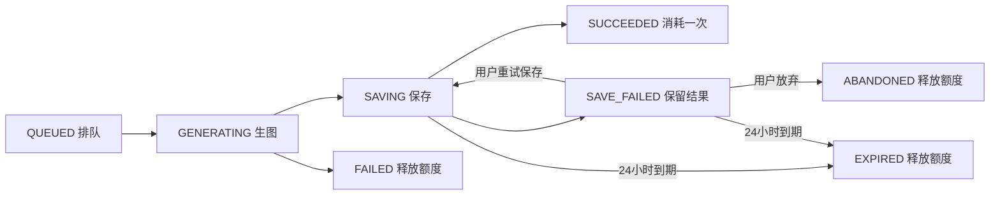

# AI 创作

## 启用

1. 先备份数据库并停止旧实例，不能让不识别 AI 预留额度的旧版与新版混跑。已有数据库执行一次 `deploy/db/migrations/20260915_ai_creation.sql`（需先完成之前的额度、管理后台迁移）；新数据库执行最新 `deploy/db/schema.sql`。应用不自动执行迁移，不要在已有库重跑初始化脚本。
2. 在开发 `.env` 或部署 `app.env` 设置 `AI_MODEL_ENCRYPTION_KEY`：32 个随机字节的 Base64。例如在可信终端用 `openssl rand -base64 32` 生成，将结果妥善保管，勿提交 Git。所有实例使用相同值；重启或发布时不能重新生成。丢失主密钥后需重新填写所有模型 API Key，尚未执行的任务快照也无法解密。
3. 构建并同步发布后端和前端，保留现有七牛、MySQL、Redis 配置。MySQL `max_allowed_packet` 至少能容纳 10 MB 临时图片和 SQL 参数，建议 32 MB 以上；多实例需共用数据库、Redis 和主密钥。
4. 管理员打开 `/admin/models`，编辑预置的 **GPT-Image-2**，填写实际 API Key，核对地址、路径、尺寸和质量后启用。初始配置不含密钥且停用，避免未经配置就产生请求。
5. 首页 `/` 为 AI 创作主入口，游客可先填写画面描述，点击“登录开始创作”后会保留描述。上传入口为 `/upload`，旧 `/create` 自动跳转首页。API Key 只在管理员提交时传至后端，随后 AES-256-GCM 加密存储；列表和编辑响应仅含 `keyConfigured`，密钥输入留空表示保留原值。

已经启用 AI 创作的数据库执行 `deploy/db/migrations/20260915_ai_resolutions.sql`，把 GPT-Image-2 的旧三种、八种或上一版 24 种尺寸同步为下表约定的 24 种有效组合；脚本可重复执行，保留自定义白名单和历史任务。此前的比例迁移仍可执行，但不再是升级的必需步骤。

预置参数：

| 配置 | 值 |
| --- | --- |
| 模型代码 | `gpt-image-2` |
| Base URL | `https://api.openai.com` |
| 生图路径 | `/v1/images/generations` |
| 默认尺寸 | `1024x1024` |
| 可选尺寸 | 下表中的全部 24 种有效组合 |
| 默认质量 | `medium` |
| 可选质量 | `low,medium,high,auto` |

用户端独立选择比例、分辨率和质量，分辨率选项同时显示自动计算的实际像素。计算规则：

- 按比例确定档位基准：3:2/2:3 最长边使用 1536、2160、3840；16:9/9:16 使用 1280、2560、3840；其余使用 1024、2048、3840。横竖版共用基准，保持最简宽高比，并按 16 像素对齐。
- 超过 8294400 总像素时等比缩小，比例单位向下对齐到 32；因此方形 4K 为 2880×2880，4:3 的 4K 为 3200×2400，仍保留 4K 档位。
- 低于 655360 总像素时等比上调到最小有效尺寸，避免模型拒绝；因此 16:9 的 1K 为 1280×720。
- 八种比例均提供三个档位，切换比例保留档位。由计算结果生成后台初始白名单，不再逐个写死尺寸。

| 比例 | 1K | 2K | 4K（自动适配上限） |
| --- | --- | --- | --- |
| 1:1 | 1024x1024 | 2048x2048 | 2880x2880 |
| 3:2 | 1536x1024 | 2160x1440 | 3456x2304 |
| 2:3 | 1024x1536 | 1440x2160 | 2304x3456 |
| 16:9 | 1280x720 | 2560x1440 | 3840x2160 |
| 9:16 | 720x1280 | 1440x2560 | 2160x3840 |
| 4:3 | 1024x768 | 2048x1536 | 3200x2400 |
| 3:4 | 768x1024 | 1536x2048 | 2400x3200 |
| 21:9 | 1344x576 | 2016x864 | 3808x1632 |

管理员自定义尺寸仍可使用，非计算预设显示为“自定义”。请求继续提交实际 `size`，服务端按模型白名单校验；历史任务保持原像素，详情显示比例、可识别的档位和像素。每张仍消耗 1 次额度，结果仍受 10 MB 文件上限和调用超时约束。

本期调用 OpenAI Images 兼容协议：JSON `model,prompt,n=1,size,quality`，Bearer API Key，响应支持 `b64_json` 或图片 URL。使用 Spring AI `spring-ai-openai:1.1.8`，按任务配置创建客户端，不引入依赖全局 Key 的 starter。仅支持相同请求/响应协议及上述质量枚举；其他供应商的私有字段或多步接口需要另行适配。地址需使用公网 HTTPS 标准端口，不支持内网、身份信息、重定向或将密钥放入查询参数。

供应商模型的可用性和账户权限需以实际账户为准。代码测试使用本地 HTTP 桩和虚构 Key，未执行付费生图或真实七牛上传。

## 用户行为与额度

- 每次生成固定一张；可选择管理员启用的模型、尺寸和质量，均消耗共享额度 1 次。
- 提交先预留 1 次，只有七牛上传和图片记录持久化完成才计入已用；AI 保存不再走普通上传的二次扣额。
- 每位用户同时最多一个未结束任务，由数据库唯一约束和共享额度锁保障；剩余额度仍可用于普通上传。
- `GET /api/app/images/quota` 返回 `total,used,reserved,remaining`，其中 `remaining=max(0,total-used-reserved)`。删除图片不退还额度，已计费的图片记录不可物理清理。
- 使用客户端生成的 UUID `requestId` 保证提交幂等。网络结果不明时须用**原 requestId 和参数**重试确认；更换 ID 会被视为新创作。
- 离开页面不取消后台任务；返回后从服务端恢复当前任务和历史。
- 已接收任务使用模型配置快照，之后停用或删除模型只影响新任务。
- `hub_image.source_type` 为 `UPLOAD` 或 `AI`，既有 `type` 继续表示 JPG/PNG 等文件格式。历史图片默认 `UPLOAD`。

## 失败与恢复

模型成功返回后先将图片字节保存在任务表 `result_data`，保留期限从取得结果时起算 24 小时。生成结果同样限制 10 MB，并复用原有图片内容检查。保存失败后只允许重试这份结果，**不重新调用模型**。成功、放弃、失败或过期会清除临时数据，终态仍保留历史与提示词。

后台每 2 秒领取任务，单实例最多 2 个任务并行，不使用消息队列。任务独立使用 Redisson 看门狗锁、数据库认领令牌和截止时间；模型调用不占用普通上传锁。七牛 I/O 在事务外，成功终态和 `hub_image` 插入在一个短事务内提交。额度缓存结算前标记待恢复，进程中断后按已计费图片重新构建消耗。

模型调用默认超时 180 秒，禁用 HTTP 自动重试。进程中断导致结果未知时，在执行期限届满、原任务锁释放后标记失败并释放预留，可能发生的上游费用由平台承担，不自动再次生成。保存线程中断则恢复为待重试保存。过期数据在后台下一次清理时删除；服务离线期间无法执行清理，恢复后继续。

`AI_WORKER_ENABLED=false` 仅用于停机维护或测试，会暂停领取和过期清理，不是用户入口开关。暂停新的创作应在后台停用所有模型；维护时先停用、等待运行任务结束，再停止实例。

保存失败日志记录任务 ID 和异常类型，不记录模型原始响应或密钥。普通异常会尝试补偿本次七牛文件；若进程在云上传后、数据库落库前硬退出，仍可能遗留云端孤立对象，需要结合任务 ID、用户目录与七牛清单人工核查。本期不增加跨云存储的通用对账系统。

## 接口

外层沿用平台 `Result<T>`，分页沿用 MyBatis-Plus `Page<T>`。用户 ID 取自 Sa-Token，所有任务和图片查询校验归属。

| 方法 / 路径 | 用途 |
| --- | --- |
| GET `/api/app/generations/models` | 用户可选模型（无地址和密钥） |
| POST `/api/app/generations` | 提交 `requestId,modelId,prompt,size,quality` |
| GET `/api/app/generations/active` | 当前未结束任务，没有时 data 为 null |
| GET `/api/app/generations?page=1&pageSize=12` | 本人创作历史 |
| GET `/api/app/generations/{id}` | 本人任务详情 |
| POST `/api/app/generations/{id}/retry-save` | 重试保存 |
| POST `/api/app/generations/{id}/abandon` | 放弃保存失败的结果 |
| GET `/api/app/images?sourceType=AI` | 按来源筛选图片；也可传 UPLOAD 或空 |
| GET / POST `/api/admin/ai-models` | 管理分页 / 新增模型 |
| PUT / DELETE `/api/admin/ai-models/{id}` | 编辑 / 逻辑删除模型 |

管理员配置字段：`name,modelCode,baseUrl,imagesPath,apiKey,sizes,defaultSize,qualities,defaultQuality,enabled,sortOrder`。名称包括已删除记录在内不得重复。默认尺寸和质量必须属于允许列表。提示词最大 4000 字符；用户任务分页每页最多 50 条，管理员模型分页每页最多 100 条。

## 验证

`mvn clean verify` 验证原有功能及新增的幂等提交、共享额度、并发竞争、权限隔离、模型配置与密钥、保存事务回滚、仅重试保存、过期释放和服务中断恢复。`AiImageClientTest` 通过本地 HTTP 服务校验实际 Spring AI 请求体与 429 不重试。H2 覆盖业务 SQL；部署前仍需在目标 MySQL 执行迁移。

前端：`npm --prefix frontend test`、`npm --prefix frontend run build`。人工浏览器验证可使用虚构接口响应，检查独立创作页面、保存失败恢复、模型编辑和移动端布局。
